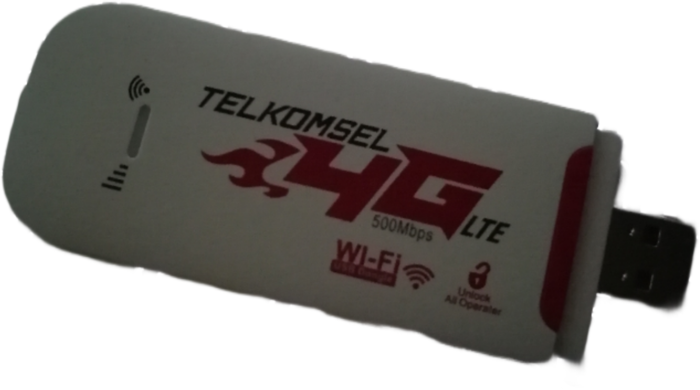

<p align="center"><a href="https://github.com/AlienWolfX/HMUFO2-VO5-USB_MODEM
" target="_blank"></a></p>

## Firmware Dump and Restore

<details>
<summary>Instructions</summary>
Before making any modifications to your device, such as rooting, it's crucial to first back up its firmware. You'll need this <a href="https://github.com/bkerler/edl">tool</a> to execute the commands below.

Note: To enable EDL mode on your device, **press the reset button** while plugging the USB modem into your PC. If the LEDs do not light up, execute the following commands.:

```
python3 edl rf {your_filename}.bin
```

To restore simply run

```
python3 edl wf {your_filename}.bin
```

</details>

## Analysis

<details>
<summary>Findings</summary>
TBA
</details>

## License

This repository is open-sourced software licensed under the [MIT license](https://opensource.org/licenses/MIT).
